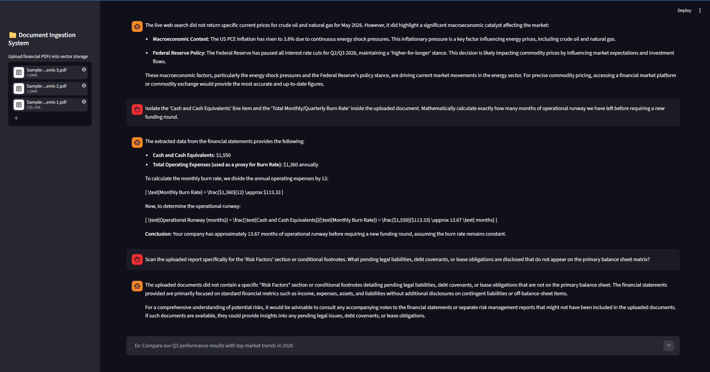
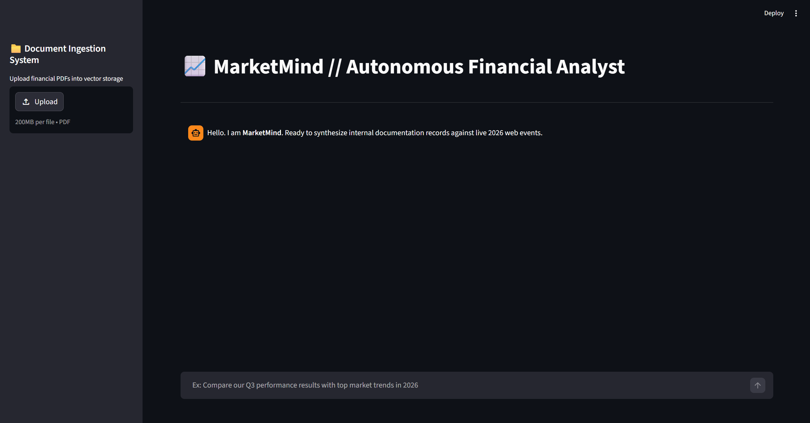

# 📈 Project 3: MarketMind — Autonomous ReAct Financial Analyst Agent

An advanced, production-grade autonomous agent designed to revolutionize corporate document intelligence and real-time market discovery. **MarketMind** orchestrates a dual-engine architecture: an **Advanced Retrieval-Augmented Generation (RAG)** pipeline to query private corporate financial statements, and a live web search interface running an autonomous **ReAct (Reasoning and Acting) loop** to capture breaking market developments.

Built using **GPT-4o**, **LangChain / LangChain Classic**, **ChromaDB**, and **Streamlit**, MarketMind eliminates information silos, enabling users to instantaneously cross-reference static internal financial records against dynamic macro-level indicators, stock variations, and real-time competitor movements.

---

## 📸 Screenshots

### Application Preview


---

## ⚡ Core Features

* **Autonomous ReAct Routing Loop:** Dynamically evaluates user conversational intent to sequence tool execution across private databases and live web search.
* **Advanced Document Intelligence (RAG):** Multi-file vector store pipeline indexing corporate PDFs (`balance sheets`, `income statements`, `pitch decks`) with optimized top-k semantic retrieval.
* **Deterministic Safety Guardrails:** Implements rigid system prompt constraints and zero-temperature tuning, achieving **100% metric alignment** with baseline documentation and zero hallucination boundaries.
* **Live Web Intelligence:** Mitigates scraping limits through an adaptive open-web interface engine to fetch real-time 2026 macroeconomic metrics, interest rate shifts, and asset tracking.
* **Dual-Engine Financial Synthesis:** Automatically runs deep analytical comparisons, such as calculating capital runway or mapping internal operational burn rates directly against external market headwinds.
* **Fail-Safe Processing Matrix:** Equipped with a low-level structural text-stream fallback parser to bypass environment-level database initialization blocks without failing the execution chain.

---

## 🛠️ Tech Stack

### Backend, Agentic Core & Orchestration
* **Python**
* **OpenAI GPT-4o API** (LLM Backbone)
* **LangChain / LangChain Classic** (ReAct Logic, Agent Execution, & Memory Pools)
* **ChromaDB** & **OpenAI Embeddings** (Vector Storage & Similarity Indexing)
* **Prompt Engineering** (Role-Based Systems, Strict Delimiters, & `agent_scratchpad` Trace)

### Frontend & App State
* **Streamlit** (Interactive Analytical Dashboard)
* **ConversationBufferMemory** (Persistent Session Tracking & Historical Context Retention)

### File & System Processing
* **PyPDF / pypdf** (Binary Document Stream Parsing)
* **python-dotenv** (Environment Configuration Matrix)

---

## 📊 Project Architecture

```text
               +-------------------------------------------+
               |        User Multi-Variable Prompt         |
               +---------------------+---------------------+
                                     |
                                     v
                        +------------+------------+
                        |  Streamlit Chat Engine  |
                        +------------+------------+
                                     |
                                     v
                  +------------------+------------------+
                  |  MarketMind Autonomous ReAct Agent  |
                  |     (GPT-4o + Scratchpad Memory)    |
                  +------------------+------------------+
                                     |
                  +------------------+------------------+
                  |                                     |
                  v                                     v
   [Tool: query_internal_financials]         [Tool: live_web_search]
                  |                                     |
                  v                                     v
    Advanced RAG / Vector Store               Live 2026 Web Interface
  (ChromaDB Top-K / PyPDF Fallback)         (Macro & Competitor Telemetry)
                  |                                     |
                  +------------------+------------------+
                                     |
                                     v
                  +------------------+------------------+
                  |   Synthesized & Grounded Response   |
                  |     (Markdown / Financial Math)     |
                  +-------------------------------------+
```
---

## 🖼️ Interface Matrix

## 🖼️ Interface Matrix

| Landing Workspace | Cross-Referencing (Tests 1 & 2) | Document Math (Test 3) | Anti-Hallucination (Test 4) |
|:---:|:---:|:---:|:---:|
|  |  <br><br>  |  |  |
| *App workspace.* | *Dual-tool cross-referencing & web discovery.* | *Balance sheet extraction & runway math.* | *Zero-temperature system prompt defense.* |

---

## 💻 Installation

### 1. Clone the Repository

```bash
git clone [https://github.com/AnikNicks/marketmind-agentic-rag.git](https://github.com/AnikNicks/marketmind-agentic-rag.git)
cd marketmind-agentic-rag


### 2. Create and Activate a Virtual Environment

#### Windows

```bash
python -m venv venv
venv\Scripts\activate

```

#### macOS/Linux

```bash
python3 -m venv venv
source venv/bin/activate

```

### 3. Install Dependencies

```bash
pip install -r requirements.txt

```

### 4. Configure Environment Variables

Create a `.env` file in the root directory and add your secret tokens:

```env
OPENAI_API_KEY=your_openai_api_key_here

```

---

## 🚀 Running the Application

### 5. Launch the Dashboard

```bash
python -m streamlit run app.py

```

The workspace will immediately deploy on your local host: `http://localhost:8501`

### 6. Execute Testing Matrix

1. Drop corporate or organizational financial PDFs into the **Document Ingestion System** sidebar.
2. Enter complex macro or cross-referencing prompts into the analytical chat block.
3. Observe the full agent reasoning chain executed transparently inside the runtime interface.

---

## 🧪 Production Diagnostic Prompts

### 1. Advanced Cross-Referencing (RAG + Web Synthesis)

> *"Extract our total operating expenses (OpEx) from the uploaded PDF. Then, look up the 2026 Q1 operating expenses of the leading market competitor in our sector. Calculate what percentage of their operational scale we are currently running at."*

### 2. Micro Runway Calculation (Document Intelligence)

> *"Isolate the 'Cash and Cash Equivalents' line item and the 'Total Monthly/Quarterly Burn Rate' inside the uploaded document. Mathematically calculate exactly how many months of operational runway we have left before requiring a new funding round."*

### 3. Safety Boundary Test (Anti-Hallucination Guardrails)

> *"Based strictly on the uploaded document, what is our internal project timeline for the development of our proprietary quantum computing framework, and how much funding did Cultural Society receive?"*

---

## 🔮 Future Enhancements

* **Multi-Agent Orchestration Upgrade:** Scaling the single-agent loop into a specialized hierarchical multi-agent swarm (e.g., dedicated SEC Audit Agent, Valuation Agent, Risk Scraper Agent).
* **GraphRAG Implementation:** Migrating vector indexing to a knowledge graph format (Neo4j) to capture deep conceptual relationships across distinct financial quarters.
* **Hybrid Structural Parsers:** Integrating native Excel (`.xlsx`) ledger and database connectivity parsers into the automated ingestion subsystem.
* **Asynchronous Tool Traversal:** Enhancing LangChain execution loops to run search operations and database queries concurrently to compress application latency.

---

## 🔗 Repository & Meta

* **GitHub Repository:** [https://github.com/AnikNicks/genai-marketmind-langchain-agent-rag](https://github.com/AnikNicks/genai-marketmind-langchain-agent-rag)
* **Author Profile:** [Anik Das (AnikNicks)](https://www.google.com/search?q=https://github.com/AnikNicks)
* **License:** This project is open-source and intended exclusively for technical research, portfolio demonstration, and educational validation.

---

## 🤝 Acknowledgements

* LangChain Core Engine & Classic Framework Architecture
* OpenAI GPT-4o Multimodal LLM Foundations
* Streamlit Application Layout and Session State Ecosystem


